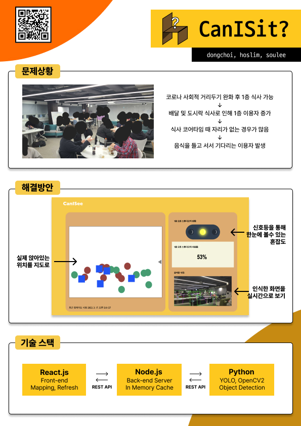

<h1 align="center">Can I Sit?</h1>

<h3 align="center">머신러닝을 활용한 착좌 감지 시스템</h3>

<p align="center">
	<a href="https://hits.seeyoufarm.com"></a>
	
</p>

> 이 프로젝트는 42 서울에서 개최한 2023년도 해커톤에서 만들었습니다. 
>(해커톤에 힘써주신 관계자 분들과 수고해주신 자원봉자사분들께 다시 한번 감사드립니다.)

## <목차>
1. 개요
* 프로젝트 명과 간단한 설명
* 프로젝트 목적
2. 설계
* 사용한 기술과 도구
* API 명세
3. Catalog
4. 정리 노션
<hr/>

## 1. 개요
### 프로젝트명
  CanISit
  1층 오픈 스튜디앉을 수 있는
  입니다. 식사/팀프로젝트/토론을 위해 1층 오픈스튜디오를 사용하는 카뎃들이 많습니다.
1층까지 내려와서 사용할 수 있는 자리가 있는지를 확인하는 수고를 덜어줄 수 있는 서비스입니다.
이미지 분석을 통해 공간의 의자 사용량을 체크하여 정보를 제공합니다.

### 해결하고자 하는 문제상황
- 코로나 거리두기 완화 후 42서울 개포 클러스터 이용자 증가, 1층 오픈 스튜디오 사용률 증가
- 배달 음식 및 도시락 식사를 하려는 이용자 증가
- 식사 코어타임 때 앉을 자리가 부족함
- 취식 가능 공간은 제한적이고, 추가적인 공간을 사용하기엔 현실적인 제약이 많음
- 결국 사용자가 1층으로 직접 내려와서 사용 가능한 자리를 확인하거나, 대기해야하는 불편함이 증가함
   
### 프로젝트 목적
- 1층 오픈스튜디오 사용자들이 1층으로 내려오기 전에 미리 사용할 수 있는 좌석이 있는지 확인할 수 있는 서비스 제공
- 사용할 수 있는 자리가 있는지 파악할 수 있는 서비스를 제공하는 것이 주된 목적

### 해결 방안
- 이미지 분석을 통해 빈의자, 사용중인 의자를 판단하여 정보 제공 

## 2. 설계
### 사용한 기술과 도구
     
① Yolo v8 : 딥러닝 객체  탐지 모델
 - Python 3.9   
 - YOLOv8 (Machine Learning, Object Dectection)   
 - OpenCv2 (Computer Vision)   
 - FastAPI (REST API)   
 - NumPy (Mathematical)    

② Node.js : data 정규화 및 data 전달 (백엔드)
 - node.js v19.8.1   
 - node.js express 4.18.2   
 - REST API   
   
③ React : 결과 출력 프론트 엔드 프레임 워크
 - React   
 - Typescript   
 - REST API     

### API 명세
Media Type: application/json

```python3
response = {
	resolution: {
		width: int,
		height: int
	},
	data: [
		{
			x: float,
			y: float,
			type: str,
            		time: str
		}
	],
	image: base64.encode(img)
}	
```

## 3. Catalog



## 4. 사용 방법
1. front_server
```shell
npm start
```
2. backend_server
```shell
npm start
```
3. ml_server
ultralytics package는 **curr <= Python 3.9** 가 필요합니다.
```shell
pip install -r requirments.txt
python main.py
```

## 5. 정리 노션
<https://helpful-eggplant-ec3.notion.site/2023-03-9a802edd9c84421083e4bbc3e0be3bc7>
